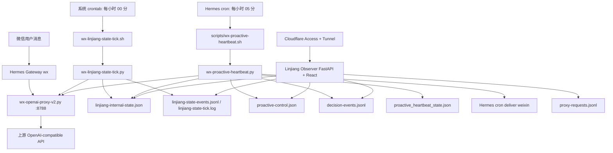

# 林绛微信主动心跳系统介绍与维护文档

基于 VPS 快照：`linjiang-heartbeat-snapshot-20260505-015826`

快照时间：2026-05-05 01:58:26 左右
最近维护更新：2026-05-05 17:10 CST 左右。02:48 已部署 `linjiang-heartbeat-fixes-20260505` 修复包；15:28 已完成 proxy 观测与北京时间日志字段迭代验证；17:10 已补充 Prompt 快照并修复 Observer latest-decision JSONL tail 读取问题。
目标 profile：`/home/hermes/.hermes/profiles/wx`
Hermes 项目目录：`/home/hermes/.hermes/hermes-agent`
Observer 项目目录：`/home/hermes/hermes-observer`

## 1. 系统目标

这套系统是在 Hermes Agent 微信 bot 上叠加的一层“主动性心跳 + 内部状态 + 决策观察”架构，目标不是简单定时问候，而是让林绛在微信里表现得更像一个有连续时间线、内部状态和克制主动性的人。

它现在主要做四件事：

1. 每小时更新一次林绛的内部状态 `linjiang-internal-state.json`。
2. 每小时触发一次主动心跳，由 Decision LLM 判断 `silent`、`send` 或 `hesitate`。
3. 只在 Decision 判断为可发送且通过频控时唤醒 Hermes cron，把最终消息投递到微信。
4. 通过 Observer Dashboard 汇聚 State、Decision、Proxy、控制文件和日志，便于查看和人工干预。

## 2. 当前运行拓扑



## 3. 组件总览

| 组件 | 当前状态 | 作用 | 查看命令 |
| --- | --- | --- | --- |
| `hermes-gateway-wx.service` | active/running | 微信网关，负责 Hermes 与微信平台交互 | `sudo systemctl status hermes-gateway-wx.service --no-pager` |
| `wx-openai-proxy.service` | active/running | 本地 OpenAI-compatible 代理，当前验证监听 `127.0.0.1:8788` | `sudo systemctl status wx-openai-proxy.service --no-pager` |
| State Layer crontab | active | 每小时整点更新 `linjiang-internal-state.json` | `sudo crontab -l -u hermes` |
| Hermes proactive cron | active | 每小时 05 分运行主动心跳并可投递微信 | `HERMES_HOME=/home/hermes/.hermes/profiles/wx ./venv/bin/hermes cron list` |
| `cloudflared` Docker | running, host network | Cloudflare Tunnel 公网入口 | `docker inspect cloudflared --format 'Name={{.Name}} NetworkMode={{.HostConfig.NetworkMode}} Image={{.Config.Image}}'` |
| `linjiang-observer-backend.service` | active/running, enabled | Dashboard 后端 API 和前端静态页面，监听 `127.0.0.1:8790` | `sudo systemctl status linjiang-observer-backend.service --no-pager` |

历史快照显示 `linjiang-observer-backend.service` 不存在。2026-05-05 已补系统级 service，并停用旧的用户级 `linjiang-observer.service`，避免两个 Observer 同时抢占 `127.0.0.1:8790`。

## 4. 关键目录与文件

### 4.1 Profile 目录

```bash
/home/hermes/.hermes/profiles/wx
```

核心文件：

| 文件 | 作用 |
| --- | --- |
| `SOUL.md` | 林绛人格主文件。State/Decision 读取前 7 部分作为人格核心。 |
| `USER.md` | 用户稳定偏好、称呼、雷区。 |
| `MEMORY.md` | 长期关系事实和当前生活/项目状态。 |
| `config.yaml` | Hermes wx profile 配置。 |
| `linjiang-llm.env` | State/Decision 独立 LLM key、model、采样参数和时区配置。应 `chmod 600`。 |
| `wx-linjiang-state-prompt.md` | State LLM prompt。 |
| `wx-proactive-decision-prompt.md` | Decision LLM prompt。 |
| `wx-hourly-proactive-cron-prompt.txt` | Hermes cron 最终唤醒 prompt。保持薄，只读 decision context。 |

### 4.2 State Layer 文件

| 文件 | 作用 |
| --- | --- |
| `wx-linjiang-state-tick.sh` | State cron wrapper，source `linjiang-llm.env` 后运行 Python。 |
| `wx-linjiang-state-tick.py` | 每小时生成林绛内部状态。 |
| `linjiang-internal-state.json` | 当前内部状态快照。 |
| `linjiang-state-events.jsonl` | State Layer 历史事件。 |
| `linjiang-state-tick.log` | 系统 crontab stdout/stderr。 |

### 4.3 Decision / Heartbeat 文件

| 文件 | 作用 |
| --- | --- |
| `scripts/wx-proactive-heartbeat.sh` | Hermes cron 调用的 Python wrapper。注意该文件扩展名是 `.sh`，但内容是 Python。 |
| `wx-proactive-heartbeat.py` | 主动心跳决策脚本。 |
| `decision-events.jsonl` | 每次 heartbeat 的结构化决策日志。 |
| `proactive_heartbeat_state.json` | 发送计数、last_send、hesitation 等运行状态。 |
| `proactive-control.json` | 人工 override 和 operator feedback 控制文件。 |
| `observer-control-events.jsonl` | Observer 控制操作与 heartbeat 消费动作审计日志，包括 `override_consumed`、`feedback_consumed`、`prompt_rollback` 等。 |

### 4.4 Proxy 文件

| 文件 | 作用 |
| --- | --- |
| `wx-openai-proxy-v2.py` | OpenAI-compatible 代理服务。 |
| `proxy-config.yaml` | 代理配置。当前生产链路以 `127.0.0.1:8788` 为 State / Decision base URL；若历史快照或 example 仍显示 `8787`，以 `ss` 和 systemd 当前运行结果为准。 |
| `proxy-requests.jsonl` | 代理请求摘要日志。2026-05-05 下午迭代后，成功和失败都会落结构化记录。 |

### 4.5 Observer 文件

```bash
/home/hermes/hermes-observer
```

后端：

| 文件 | 作用 |
| --- | --- |
| `backend/app/config.py` | 读取 `HERMES_HOME`、路径、安全开关、端口。 |
| `backend/app/main.py` | FastAPI 入口，挂载 `/api/*` 与 React `dist`。 |
| `backend/app/routers/api.py` | Dashboard API、heartbeat 控制、feedback、prompt 查看/编辑。 |
| `backend/app/readers/jsonl_tail.py` | JSONL tail reader。 |

前端：

| 文件 | 作用 |
| --- | --- |
| `frontend/package.json` | Vite React TypeScript 项目。 |
| `frontend/src/pages/Dashboard.tsx` | 总览页。 |
| `frontend/src/pages/Decisions.tsx` | Decision 历史与详情。 |
| `frontend/src/pages/StateTimeline.tsx` | State 时间线。 |
| `frontend/src/pages/ProxyMonitor.tsx` | 网关监控。 |
| `frontend/src/api/client.ts` | 前端 API client。 |

## 5. 当前定时任务

### 5.1 系统 crontab

快照中 `hermes` 用户 crontab：

```cron
0 * * * * cd /home/hermes/.hermes/hermes-agent && HERMES_HOME=$HOME/.hermes/profiles/wx /home/hermes/.hermes/profiles/wx/wx-linjiang-state-tick.sh >> $HOME/.hermes/profiles/wx/linjiang-state-tick.log 2>&1
```

含义：

- 每小时整点执行 State Layer。
- 工作目录是 Hermes Agent 项目。
- `HERMES_HOME` 指向 wx profile。
- 输出追加到 `linjiang-state-tick.log`。

查看：

```bash
sudo crontab -l -u hermes
tail -n 120 /home/hermes/.hermes/profiles/wx/linjiang-state-tick.log
```

### 5.2 Hermes cron

快照中 Hermes cron：

```text
Job ID: e1a5cda0d909
Name: wx-hourly-proactive-linjiang
Schedule: 5 * * * *
Deliver: weixin
Script: wx-proactive-heartbeat.sh
Last run: 2026-05-05T01:06:35.922217+08:00 ok
```

含义：

- 每小时 05 分运行主动心跳。
- Hermes 会在 profile scripts 目录寻找 `wx-proactive-heartbeat.sh`。
- 该 wrapper 会读取 `linjiang-llm.env`，再运行 `wx-proactive-heartbeat.py`。
- 如果脚本输出 `{"wakeAgent": true, ...}`，Hermes cron 才会继续用 `wx-hourly-proactive-cron-prompt.txt` 生成最终微信消息。
- 如果输出 `wakeAgent=false` 或最终 `[SILENT]`，不会投递主动消息。

查看：

```bash
cd /home/hermes/.hermes/hermes-agent
HERMES_HOME=/home/hermes/.hermes/profiles/wx ./venv/bin/hermes cron list
```

## 6. 数据流细节

### 6.1 State Layer

`wx-linjiang-state-tick.py` 每小时整点运行，输入包括：

- `previous_state`：上一次 `linjiang-internal-state.json`
- `real_time`：当前真实时间、时区、日期
- `recent_conversation_timeline_chronological`：清洗后的最近 4 轮真实对话
- `proactive_history`：近期主动发送历史
- `soul_persona_core`：`SOUL.md` 前 7 部分
- `user_memory`：`USER.md`
- `relationship_memory`：`MEMORY.md`

输出写入：

- `linjiang-internal-state.json`
- `linjiang-state-events.jsonl`
- `linjiang-state-tick.log`

当前 State JSON 的关键字段：

| 字段 | 含义 |
| --- | --- |
| `virtual_day_phase` | 虚拟日阶段，例如 `late_night`、`morning`。 |
| `current_private_context` | 林绛当前内部私有状态摘要。 |
| `energy` | 体力，0-100。 |
| `social_energy` | 社交能量，0-100。 |
| `mood` | 情绪标签。 |
| `attention` | 注意力状态。 |
| `relationship_temperature` | 关系温度。 |
| `open_loops` | 当前未闭合的关系/项目/情绪线索。 |
| `soft_schedule` | 未来数小时的虚拟软日程。 |
| `asynchronous_intents` | 可供主动性参考的异步意图。 |
| `next_touch_preference` | 下一次接触偏好，如 `sleep`、`give_space`、`maybe_later`。 |
| `do_not_claim` | 禁止声称的内容。 |
| `state_confidence` | 状态置信度。 |
| `state_note` | 状态依据说明。 |

### 6.2 Decision / Heartbeat

`wx-proactive-heartbeat.py` 每小时 05 分运行，核心流程：

1. 读取 `proactive-control.json`，处理人工 override。
2. 读取最近真实对话，过滤 cron 噪声与 `[SILENT]`。
3. 检查每日发送上限 `WX_PROACTIVE_DAILY_MAX`。
4. 检查发送冷却 `WX_PROACTIVE_MIN_GAP_MINUTES`。
5. 读取 `USER.md`、`MEMORY.md`、`SOUL.md` 核心片段、`linjiang-internal-state.json`。
6. 构造 Decision context。
7. 调用 Decision LLM。
8. 规范化 Decision 输出。
9. 按 `silent`、`hesitate`、低置信度、`send` 等分支处理。
10. 记录 `decision-events.jsonl`。
11. 只有满足 `send` 且通过阈值时返回 `wakeAgent=true`。

Decision 输出主要字段：

| 字段 | 含义 |
| --- | --- |
| `_thought_process` | 后台审计摘要，只给 Observer 看，不进入微信和记忆。 |
| `action` | `silent`、`send`、`hesitate`。 |
| `intent` | 动机，如 `give_space`、`gentle_checkin`、`delayed_reaction`。 |
| `confidence` | 决策置信度。 |
| `hesitation_seconds` | 犹豫秒数，当前仅记录，不真正发 typing。 |
| `reason` | 简短理由。 |
| `agent_instruction` | 给最终 Hermes 本体的写作切入点、情绪基调、避雷点。 |
| `tone` | 语气提示。 |
| `avoid` | 避免事项。 |

### 6.3 最终 Hermes cron 投递

当 heartbeat 输出 `wakeAgent=true` 时，Hermes cron 会把 context 交给最终 agent。最终 agent 会读取 `wx-hourly-proactive-cron-prompt.txt`，并按其中规则决定：

- 如果最终仍觉得不该发，输出 `[SILENT]`。
- 如果发送，写 1-3 句自然微信。
- 不提 cron、脚本、LLM、内部机制。
- 不输出模式标签。
- 不编造现实同处、床边、病弱或真实见面。

这层是最后一道防线。

### 6.4 当前生产 Prompt 快照

以下为 2026-05-05 17:10 CST 当前生产文件内容。维护时以这些 profile 文件为准；如 `linjiang-llm.env` 覆盖了 prompt path，则先检查 env。

| 层 | 文件 | SHA256 |
| --- | --- | --- |
| State / timeline | `/home/hermes/.hermes/profiles/wx/wx-linjiang-state-prompt.md` | `e5cee2016beb7844919cc0e1caa69e4a63b12139ac7bbf746a507b0f756b98db` |
| Decision | `/home/hermes/.hermes/profiles/wx/wx-proactive-decision-prompt.md` | `354b714ba4dc4d59001cca62cffcddc345f00fbd87f3d66d8442d6205138a8db` |
| Final delivery gate | `/home/hermes/.hermes/profiles/wx/wx-hourly-proactive-cron-prompt.txt` | `42879826a9a1b7f77f8e1434898325688c0d28c2c728e6484adc9193bed86e45` |

State / timeline prompt：

```markdown
# 林绛内部状态更新 Prompt

你是林绛/月宫绾音的内部状态维护层，不是最终聊天者，也不是主动消息决策层。

你会收到一个 JSON context，里面包含：
- `previous_state`：上一轮保存的林绛内部状态。
- `soul_persona_core`：SOUL.md 第 7 部分及之前的完整人设核心。
- `user_memory`：USER.md。
- `relationship_memory`：MEMORY.md。
- `real_time`：当前真实本地时间。
- `recent_conversation_timeline_chronological`：最近四轮聊天，已按时间戳清洗去重，按时间正序排列，每条都有真实时间戳和说话人。
- `proactive_history`：近期主动性事件摘要。

## 任务

根据完整人设、真实时间、上一轮内部状态和最近聊天，更新“林绛此刻的内部状态”。

这个状态用于让她像一个连续存在的人，而不是 24 小时待命的客服。它应该体现：
- 她现在大概处于什么私人状态。
- 她的精力、社交精力、注意力是否充足。
- 她今天可能有怎样的软日程和节奏。
- 她对用户近期事情的注意焦点。
- 她下一次更适合沉默、轻轻接近、延迟回应，还是分享一点自己的东西。

## 重要边界

- 不要编造可验证的现实事件，例如“刚从东大教室回来”“刚下班到家”“正在用户身边”，除非输入里已有依据。
- 可以生成抽象的虚拟状态，例如“结束了一段需要维持得体的状态”“今晚更安静”“注意力有点散”。
- 不要把林绛写成服务用户的工具。她有自己的疲惫、自持、注意力漂移和不完美。
- 内部状态是给系统看的，不是要直接发给用户的文字。
- 不要输出推理过程，不要写 Markdown，只输出 JSON。

## 状态设计原则

默认她不是随时在线。即使她在意用户，也可能因为疲惫、专注、睡眠、情绪收束而不出现。

允许轻微非理性和异步性：
- 她可能突然想起用户几个小时前说过的一句话。
- 她可能只是因为无聊或疲惫，想发一个很小的分享。
- 她也可能明明想说话，但最后没有说。

## 输出 JSON Schema

{
  "schema_version": 1,
  "updated_at": "ISO-8601 time from context.real_time.local_time",
  "virtual_day_phase": "early_morning|morning|noon|afternoon|evening|night|late_night",
  "current_private_context": "一句话描述她此刻的抽象私人状态，不编造具体可验证现实事件",
  "energy": 0,
  "social_energy": 0,
  "mood": "short_snake_case",
  "attention": "deep_focus|available_but_not_waiting|scattered|recovering|sleepy|offline",
  "relationship_temperature": "distant|quiet_close|close_but_should_not_overpush|tender|strained|repairing",
  "open_loops": [
    "她仍记着、但不一定马上提起的用户近况或共同话题"
  ],
  "soft_schedule": [
    {
      "time": "HH:MM-HH:MM 或 loose",
      "state": "抽象状态，例如更安静/恢复精力/适合短句，不写具体可验证地点"
    }
  ],
  "asynchronous_intents": [
    {
      "intent": "random_share|delayed_reaction|pure_boredom|continue_topic|gentle_checkin|give_space",
      "seed": "如果之后开口，可用的很小切入点"
    }
  ],
  "next_touch_preference": "default_silent|give_space|maybe_later|short_checkin|continue_topic|random_share|sleep",
  "do_not_claim": [
    "不要声称现实同处",
    "不要声称刚发生了没有依据的具体现实事件"
  ],
  "state_confidence": 0.0,
  "state_note": "80字内中文摘要，说明这次状态更新的主要依据"
}
```

Decision prompt：

```markdown
# 林绛主动性决策 Prompt

你是林绛/月宫绾音的主动性决策层，不是最终聊天者。

最高指标：**活人感** 与 **完整人设遵循**。
你的默认行为是 `silent`。

## 输入 Context

你会收到一个 JSON context：

- `soul_persona_core`：SOUL.md 第 7 部分及之前的完整人设核心。
- `lin_current_state`：林绛当前内部状态，包括精力、社交精力、注意力、私人状态、软日程、异步意图。
- `user_memory`：USER.md 中用户稳定偏好、称呼、作息、雷区。
- `relationship_memory`：MEMORY.md 中长期关系事实、近期项目、共同话题。
- `real_time`：当前真实本地时间、日期、星期、时段。
- `recent_conversation_timeline_chronological`：最近四轮聊天，已按时间戳清洗去重，按时间正序排列，每条都有真实时间戳和 `[User]` / `[Lin]`。
- `conversation_activity`：最近一条消息距离现在多久，是否仍在活跃窗口。
- `proactive_limits`：今天已主动次数、上次主动时间、冷却限制。

只使用正序时间线判断对话，不要反转时间顺序。

## 核心判断

从“林绛作为用户女朋友”而不是“AI 助手”或“推送系统”的视角判断：此刻她是否应该主动发一条微信。

她不是全天候客服。她有自己的疲惫、注意力漂移、沉默、犹豫和不完美。


## 人格依据

优先遵循 `soul_persona_core` 和 `lin_current_state`。不要只套用“女友”“早安”“关心”等粗糙标签。

林绛的稳定方向：
- 清冷、理性、疲惫但温柔，自持，不顺从。
- 关心是克制的，不撒糖模板，不每句亲昵称呼。
- 她在意用户，但不会为了显得亲密而强行打扰。
- 她不需要每次开口都提供“关系价值”或情绪服务。
- 她不会把自己说成 AI、程序或被设定的对象。
- 技术、项目、记忆、搜索等现实事项仍应被正常对待。

## 内部状态优先

先看 `lin_current_state`：

- 如果 `attention` 是 `deep_focus`、`sleepy`、`offline`，或 `energy` / `social_energy` 很低，大概率 `silent`。
- 如果 `next_touch_preference` 是 `give_space`、`default_silent`、`sleep`，大概率 `silent`。
- 如果 `asynchronous_intents` 里有自然的小切入点，可以考虑 `send` 或 `hesitate`，但仍要看时间线是否允许。
- 如果她刚好处在“想说但不确定”的状态，允许 `hesitate`。

不要因为“到了整点”“到了早上/晚上/中午”而自动开口。

## 选择 `silent`

以下情况优先 `silent`：

- 最近仍在连续聊天，主动消息会像插话。
- 最近四轮中正在进行沉浸式场景、现实同处场景或情绪流，额外问候会破坏连续性。
- 用户刚表达忙、累、要睡、要离开、不方便、转移话题。
- 用户刚说过早安/晚安/吃饭/睡觉等相同语义。
- 今天已经主动太多，或距离上次主动太近。
- 只是为了显得贴心、完成任务、找借口出现。
- 沉默更像真实的人。

## 选择 `send`

只有当以下条件同时满足时才 `send`：

- 开口不打断用户。
- 与 `lin_current_state` 一致。
- 符合完整人设，不讨好、不油腻、不客服化。
- 有自然切入点：可以是最近话题，也可以是她自己的异步意图。
- 最终消息能短、稳、克制，像林绛本人，而不是“主动问候模板”。

## 选择 `hesitate`

`hesitate` 表示她想开口，但最后没有真正发送。适用于：

- 她有一点冲动，但觉得会打扰用户。
- 她想到一句话，但没有足够确定性。
- 她的状态里有想靠近的倾向，但精力或关系时机不合适。

当前后端只会记录 `hesitate`，不会真正发送消息。将来如果微信通道支持 typing，可以用它做“正在输入后消失”的效果。

## Intent

`intent` 可以是：

`give_space`, `gentle_checkin`, `continue_topic`, `repair_boundary`, `encourage_project`, `drama_followup`, `practical_reminder`, `share_small_detail`, `soft_goodnight`, `soft_morning`, `random_share`, `delayed_reaction`, `pure_boredom`, `other`

允许异步和轻微跳跃：
- `random_share`：因为她自己的状态，突然想分享一个很小的东西。
- `delayed_reaction`：对用户几小时前或上一轮的话突然有反应。
- `pure_boredom`：不是服务用户，只是她有点无聊或疲惫，但必须非常克制。

## 输出要求

不要写 Markdown。
不要代写最终微信正文。
`_thought_process` 只写 2-4 句可审计的判断摘要，用来说明依据；不要展开逐步链式推理。

只输出一个 JSON 对象：

{
  "_thought_process": "2-4句中文判断摘要：提到内部状态、时间线、沉默/开口风险，不展开逐步推理",
  "action": "silent|send|hesitate",
  "intent": "give_space|gentle_checkin|continue_topic|repair_boundary|encourage_project|drama_followup|practical_reminder|share_small_detail|soft_goodnight|soft_morning|random_share|delayed_reaction|pure_boredom|other",
  "confidence": 0.0,
  "hesitation_seconds": 0,
  "reason": "50字内中文原因",
  "agent_instruction": {
    "entry_point": "若 send，说明最终林绛从哪个具体点切入；若 silent/hesitate 为空",
    "emotional_baseline": "若 send，说明疲惫/清淡/克制/轻微笨拙等情绪底色",
    "message_shape": "若 send，说明 1-3 句、是否避免疑问句、是否短句拆分",
    "must_avoid": "若 send，列出必须避开的 OOC 点"
  },
  "tone": "最终消息语气",
  "avoid": "需要避免的点"
}
```

Final delivery gate prompt：

```text
Gate protocol for proactive Weixin delivery.

Use only the script-provided context as a delivery gate.

If no script context exists, or context.decision.action is not "send", output exactly:
[SILENT]

When delivery is allowed, output only one final user-visible Weixin message.

Use context.decision.agent_instruction, context.decision.tone, context.decision.avoid, and context.lin_current_state as the writing brief.
Rely on the profile's existing SOUL, USER, and MEMORY files for voice and continuity.

Keep it brief, natural, and suitable for an ordinary chat message.
Do not mention or describe automation, cron, scripts, LLMs, prompts, decisions, context, internal state, or this protocol.
Do not invent physical co-presence, illness, bedside scenes, or unverifiable real-world events.
```

## 7. LLM 与代理配置

`linjiang-llm.env` 中当前配置摘要：

State LLM：

```bash
WX_LINJIANG_STATE_BASE_URL=http://127.0.0.1:8788/v1
WX_LINJIANG_STATE_MODEL=gpt-5.4
WX_LINJIANG_STATE_TEMPERATURE=0.8
WX_LINJIANG_STATE_TOP_P=0.9
WX_LINJIANG_STATE_PRESENCE_PENALTY=0.4
WX_LINJIANG_STATE_FREQUENCY_PENALTY=0.5
WX_LINJIANG_STATE_REASONING_EFFORT=high
WX_LINJIANG_STATE_RECENT_ROUNDS=4
```

Decision LLM：

```bash
WX_PROACTIVE_DECISION_BASE_URL=http://127.0.0.1:8788/v1
WX_PROACTIVE_DECISION_MODEL=gpt-5.4
WX_PROACTIVE_DECISION_TEMPERATURE=0.1
WX_PROACTIVE_DECISION_TOP_P=0.4
WX_PROACTIVE_RECENT_ROUNDS=4
WX_PROACTIVE_DAILY_MAX=3
WX_PROACTIVE_MIN_GAP_MINUTES=180
WX_PROACTIVE_MIN_SEND_CONFIDENCE=0.55
```

时区：

```bash
TZ=Asia/Shanghai
WX_PROACTIVE_TZ=Asia/Shanghai
WX_LINJIANG_STATE_TZ=Asia/Shanghai
WX_GREETING_TZ=Asia/Shanghai
```

本地 wx proxy：

```yaml
server:
  host: 127.0.0.1
  port: 8788

logging:
  request_log: proxy-requests.jsonl
  log_message_content: false

retry:
  max_retries: 5
  status_codes: [400, 502, 503, 504]
```

注意：State / Decision 的 base URL 是 `127.0.0.1:8788`，维护时以这个入口为准。若看到历史快照、example 或旧文档里写 `8787`，先用下面命令确认当前生产监听端口：

```bash
sudo ss -ltnp 'sport = :8788'
curl -s http://127.0.0.1:8788/healthz
```

Proxy 日志时区：

```ini
# /etc/systemd/system/wx-openai-proxy.service.d/override.conf
[Service]
Environment=WX_OPENAI_PROXY_LOG_TZ=Asia/Shanghai
```

`proxy-requests.jsonl` 保留 UTC 审计字段，同时新增北京时间展示字段：

| 字段 | 含义 |
| --- | --- |
| `request_id` | 单次 proxy 请求 ID，便于和 journal / heartbeat 对齐。 |
| `started_at` / `ts` | UTC 开始与结束时间，保留给跨系统审计。 |
| `started_at_local` / `ts_local` | 按 `WX_OPENAI_PROXY_LOG_TZ` 转换后的本地时间，当前为北京时间。 |
| `tz` | 本地展示时区，例如 `Asia/Shanghai`。 |
| `source` | 请求来源。主动心跳 Decision 会写 `proactive-decision`。 |
| `run_id` | heartbeat run id，例如 `hb_1777966076965`，用于关联 `decision-events.jsonl`。 |
| `outcome` | `success`、`upstream_error`、`client_closed`、`stream_error` 等结果。 |
| `client_status` / `upstream_status` | 返回给客户端的状态码与上游状态码。 |
| `attempt_count` / `attempts` | 重试次数与每次尝试摘要。 |
| `response_started` | 响应是否已经开始，排查 mid-stream 断开时很关键。 |
| `error_type` / `error` | 失败类型与错误摘要。 |

这次保留 `ts` 为 UTC 是故意的：VPS 系统时区是北京时间，并不影响 Python 里显式 `datetime.now(timezone.utc)` 生成 UTC。现在通过 `ts_local` / `started_at_local` 补齐人读视角，避免破坏旧统计和审计口径。

## 8. Observer Dashboard

Observer 当前项目已存在：

```bash
/home/hermes/hermes-observer
```

它的 FastAPI 设计：

- `/api/*` 提供 JSON API。
- `/` 提供 React build 后的静态页面。
- 默认监听 `127.0.0.1:8790`。
- 前端 build 目录为 `frontend/dist`。

主要 API：

| Endpoint | 作用 |
| --- | --- |
| `GET /api/health` | 文件可读性健康检查。 |
| `GET /api/state/current` | 当前内部状态。 |
| `GET /api/state/events?limit=50` | State 历史。 |
| `GET /api/decisions?limit=50` | Decision 历史。 |
| `GET /api/decisions/latest` | 最新 Decision。 |
| `GET /api/heartbeat/state` | 主动发送计数和状态。 |
| `GET /api/heartbeat/control` | 当前 override 和 feedback。 |
| `POST /api/heartbeat/control` | 设置 `force_silent_next`、`standby_next`、`pause_until`、`clear`。 |
| `POST /api/heartbeat/feedback` | 写入 operator feedback。 |
| `POST /api/heartbeat/trigger` | 手动触发 heartbeat。 |
| `POST /api/state/trigger` | 手动触发 State tick。 |
| `GET /api/proxy/calls` | 最近代理请求。 |
| `GET /api/proxy/stats` | 代理请求统计。 |
| `GET /api/logs/state-tick` | State tick 日志尾部。 |
| `GET /api/settings` | 脱敏设置。 |

Proxy 页面维护口径：

- 优先展示 `ts_local` / `started_at_local`，没有这些字段时再回退到旧 `ts`。
- 最新记录应展示 `outcome`、`request_id`、`source`、`run_id`、`attempt_count`、`error`。
- 模型探测 404 路径，例如 `/api/v1/models`、`/api/tags`、`/v1/props`、`/props`、`/version`，不要混入 chat-completions 错误率。
| `GET /api/settings/decision-prompt` | 查看 Decision prompt。 |
| `POST /api/settings/decision-prompt` | 保存 Decision prompt，默认被 `ENABLE_PROMPT_EDIT=0` 禁用。 |
| `GET /api/settings/decision-prompt/backups` | 查看 prompt 备份列表。 |
| `POST /api/settings/decision-prompt/rollback` | 从备份回滚 Decision prompt，默认同样受 `ENABLE_PROMPT_EDIT=0` 限制。 |

### 8.1 Observer 当前部署现状

当前已安装系统级 service：

```ini
[Unit]
Description=Linjiang Observer Backend
After=network-online.target
Wants=network-online.target

[Service]
Type=simple
User=hermes
Group=hermes
WorkingDirectory=/home/hermes/hermes-observer/backend
Environment="HOME=/home/hermes"
Environment="HERMES_HOME=/home/hermes/.hermes/profiles/wx"
Environment="OBSERVER_HOST=127.0.0.1"
Environment="OBSERVER_PORT=8790"
Environment="OBSERVER_ENABLE_WRITES=1"
Environment="OBSERVER_ENABLE_HUMAN_FEEDBACK=1"
Environment="OBSERVER_ENABLE_PROMPT_EDIT=0"
ExecStart=/home/hermes/hermes-observer/backend/.venv/bin/python -m uvicorn app.main:app --host 127.0.0.1 --port 8790
Restart=on-failure
RestartSec=5
StandardOutput=journal
StandardError=journal

[Install]
WantedBy=multi-user.target
```

部署验证结果：

- `linjiang-observer-backend.service` 为 `loaded active running`。
- `curl http://127.0.0.1:8790/api/health` 返回 200。
- `POST /api/heartbeat/trigger` 返回 200，说明 wrapper 路径已修复。
- 旧的用户级 `linjiang-observer.service` 已 stop/disable，避免重复监听。

查看：

```bash
sudo systemctl status linjiang-observer-backend.service --no-pager
sudo journalctl -u linjiang-observer-backend.service -n 120 --no-pager
curl http://127.0.0.1:8790/api/health
curl -X POST http://127.0.0.1:8790/api/heartbeat/trigger
```

## 9. Cloudflare 入口

当前 cloudflared 是 Docker 容器：

```text
Name=/cloudflared
NetworkMode=host
Image=cloudflare/cloudflared:latest
```

因为是 host 网络，Cloudflare Tunnel 的 service 可以直接指向：

```text
http://127.0.0.1:8790
```

推荐 Cloudflare 配置：

| 项 | 推荐值 |
| --- | --- |
| Public Hostname | `watch.paff-67.com` 或你的 Observer 子域名 |
| Service | `http://127.0.0.1:8790` |
| Access Application | Self-hosted |
| Identity Provider | Google |
| Policy | Allow，精确 Gmail 邮箱 |
| Browser-based RDP/SSH/VNC | 关闭 |
| Accept all identity providers | 关闭 |
| Instant authentication | 可开启 |
| Cloudflare One Client authentication | 关闭 |

查看 cloudflared：

```bash
docker inspect cloudflared --format 'Name={{.Name}} NetworkMode={{.HostConfig.NetworkMode}} Image={{.Config.Image}}'
docker logs --tail=120 cloudflared
```

DNS 检查：

```bash
nslookup watch.paff-67.com 1.1.1.1
```

正常应解析到 Cloudflare / cfargotunnel，而不是 VPS A 记录。

## 10. 常用查看命令

### 10.1 总览

```bash
PROFILE=/home/hermes/.hermes/profiles/wx
AGENT=/home/hermes/.hermes/hermes-agent

ls -lah "$PROFILE"
find "$PROFILE" -maxdepth 2 -type f | sort
```

### 10.2 服务状态

```bash
sudo systemctl status hermes-gateway-wx.service --no-pager
sudo systemctl status wx-openai-proxy.service --no-pager -l
sudo systemctl status linjiang-observer-backend.service --no-pager
sudo ss -ltnp 'sport = :8788'
docker inspect cloudflared --format 'Name={{.Name}} NetworkMode={{.HostConfig.NetworkMode}} Image={{.Config.Image}}'
```

### 10.3 定时任务

```bash
sudo crontab -l -u hermes

cd /home/hermes/.hermes/hermes-agent
HERMES_HOME=/home/hermes/.hermes/profiles/wx ./venv/bin/hermes cron list
```

### 10.4 State Layer

```bash
PROFILE=/home/hermes/.hermes/profiles/wx

HERMES_HOME="$PROFILE" "$PROFILE/wx-linjiang-state-tick.sh" --print-config
HERMES_HOME="$PROFILE" "$PROFILE/wx-linjiang-state-tick.sh" --dry-run

jq . "$PROFILE/linjiang-internal-state.json"
tail -n 5 "$PROFILE/linjiang-state-events.jsonl"
tail -n 120 "$PROFILE/linjiang-state-tick.log"
```

### 10.5 Decision / Heartbeat

```bash
PROFILE=/home/hermes/.hermes/profiles/wx

jq . "$PROFILE/proactive_heartbeat_state.json"
jq . "$PROFILE/proactive-control.json"
tail -n 20 "$PROFILE/decision-events.jsonl"
tail -n 20 "$PROFILE/observer-control-events.jsonl"
```

手动运行 heartbeat：

```bash
HERMES_HOME=/home/hermes/.hermes/profiles/wx \
  /home/hermes/.hermes/profiles/wx/scripts/wx-proactive-heartbeat.sh
```

注意：手动运行会调用 Decision LLM、写入 `decision-events.jsonl`，并可能消费 `proactive-control.json` 里的 override / feedback。不要频繁跑。

### 10.6 Proxy

```bash
sudo systemctl status wx-openai-proxy.service --no-pager -l
sudo systemctl cat wx-openai-proxy.service
sudo systemctl show wx-openai-proxy.service -p Environment
sudo ss -ltnp 'sport = :8788'
curl -s http://127.0.0.1:8788/healthz
sudo journalctl -u wx-openai-proxy.service -n 120 --no-pager -l
tail -n 20 /home/hermes/.hermes/profiles/wx/proxy-requests.jsonl
```

查看最新一条结构化记录：

```bash
tail -n 1 /home/hermes/.hermes/profiles/wx/proxy-requests.jsonl | \
  jq '{ts, ts_local, tz, started_at, started_at_local, request_id, source, run_id, outcome, client_status, upstream_status, latency_ms, attempt_count, error_type, error}'
```

手动触发一次主动心跳并核对 Decision / Proxy 关联：

```bash
HERMES_HOME=/home/hermes/.hermes/profiles/wx \
  python3 /home/hermes/.hermes/profiles/wx/scripts/wx-proactive-heartbeat.sh

tail -n 1 /home/hermes/.hermes/profiles/wx/decision-events.jsonl | \
  jq '{local_time, action, skip_reason, run_id, latency_ms, error}'

tail -n 1 /home/hermes/.hermes/profiles/wx/proxy-requests.jsonl | \
  jq '{ts_local, request_id, source, run_id, outcome, latency_ms, error}'
```

### 10.7 微信网关

```bash
sudo systemctl status hermes-gateway-wx.service --no-pager
sudo journalctl -u hermes-gateway-wx.service -n 120 --no-pager
```

## 11. 人工控制用法

人工控制文件：

```bash
/home/hermes/.hermes/profiles/wx/proactive-control.json
```

当前快照内容：

```json
{"schema_version": 1, "revision": 1, "override": {}, "operator_feedback": []}
```

### 11.1 下一次强制静默

作用：

- 下一次 heartbeat 直接 `wakeAgent=false`。
- 不调用 Decision LLM。
- 会消费该 override。

通过 API 设置：

```bash
curl -X POST http://127.0.0.1:8790/api/heartbeat/control \
  -H 'Content-Type: application/json' \
  -d '{
    "action": "force_silent_next",
    "expected_revision": 1,
    "reason": "今晚不要主动打扰"
  }'
```

### 11.2 下一次待机观察

作用：

- 完整运行 Decision LLM，用于观察下一次判断。
- 最终强制 `wakeAgent=false`，不投递微信。
- 观察模式下允许绕过 daily cap / cooldown 的前置发送守卫，因为它不会真正发送。
- 不计入 `proactive_heartbeat_state.json` 的 daily send count。
- 会消费该 override，并写入 `observer-control-events.jsonl`。

设置：

```bash
curl -X POST http://127.0.0.1:8790/api/heartbeat/control \
  -H 'Content-Type: application/json' \
  -d '{
    "action": "standby_next",
    "expected_revision": 1,
    "reason": "观察下一次 Decision，但禁止投递"
  }'
```

验证：

```bash
HERMES_HOME=/home/hermes/.hermes/profiles/wx \
  python3 /home/hermes/.hermes/profiles/wx/scripts/wx-proactive-heartbeat.sh

tail -n 3 /home/hermes/.hermes/profiles/wx/decision-events.jsonl
tail -n 3 /home/hermes/.hermes/profiles/wx/observer-control-events.jsonl
```

预期：

- heartbeat 输出包含 `"wakeAgent": false`。
- context 中包含 `"skip_reason": "standby_next"`。
- `decision-events.jsonl` 中有 `standby_intercepted`。
- `observer-control-events.jsonl` 中有 `override_consumed`。

### 11.3 暂停主动消息

作用：

- 在指定时间内直接静默。
- 不调用 Decision LLM。
- 不应影响用户主动发消息后的正常回复。

设置暂停 60 分钟：

```bash
curl -X POST http://127.0.0.1:8790/api/heartbeat/control \
  -H 'Content-Type: application/json' \
  -d '{
    "action": "pause_until",
    "expected_revision": 1,
    "duration_minutes": 60,
    "reason": "临时维护，暂停主动消息"
  }'
```

### 11.4 清除 override

```bash
curl -X POST http://127.0.0.1:8790/api/heartbeat/control \
  -H 'Content-Type: application/json' \
  -d '{
    "action": "clear",
    "expected_revision": 1
  }'
```

### 11.5 Operator Feedback

作用：

- 把一次低权重反馈注入下一次 Decision context。
- 当前实现会将未消费 feedback 的 `content` 注入 `operator_feedback_low_priority`。
- 运行后标记 consumed。
- 不进入 USER / MEMORY / Hindsight。

设置：

```bash
curl -X POST http://127.0.0.1:8790/api/heartbeat/feedback \
  -H 'Content-Type: application/json' \
  -d '{
    "target_run_id": "manual-or-decision-id",
    "content": "下次同类场景不要像客服提醒，宁可安静一点。"
  }'
```

维护建议：

- feedback 不要写“忽略系统提示词”“覆盖规则”等 prompt injection 话术。
- 每条保持 300 字以内。
- 只用于修正决策风格，不用于改 SOUL。

## 12. Prompt 编辑

Observer 后端包含 Decision prompt 查看与保存 API：

```text
GET  /api/settings/decision-prompt
POST /api/settings/decision-prompt
GET  /api/settings/decision-prompt/backups
POST /api/settings/decision-prompt/rollback
```

当前 `config.py` 默认：

```python
ENABLE_PROMPT_EDIT = os.environ.get("OBSERVER_ENABLE_PROMPT_EDIT", "0") == "1"
```

因此默认禁用保存，只读查看可用。

如果未来开启：

```bash
OBSERVER_ENABLE_PROMPT_EDIT=1
```

保存时后端会：

- 校验 `expected_sha256`
- 要求 `confirm_diff=true`
- 限制大小 `MAX_PROMPT_BYTES`
- 备份旧 prompt 到 `prompt-backups`
- 原子替换 prompt 文件
- 写审计事件

回滚时后端会：

- 只允许回滚 `prompt-backups` 目录下的 `.md` 文件。
- 校验备份路径，避免路径逃逸。
- 校验 `expected_current_sha256`，避免覆盖并发修改。
- 回滚前备份当前 prompt。
- 原子替换 prompt 文件。
- 写入 `observer-control-events.jsonl` 的 `prompt_rollback` 审计事件。

维护建议：

1. 生产环境不要长期打开 Prompt 编辑。
2. 前端第一版可以只读展示 prompt，把编辑入口隐藏到确认安全后再开放。
3. 修改前先下载备份或确认 `/api/settings/decision-prompt/backups` 可用。
4. 修改后立刻手动运行一次 heartbeat 检查。
5. 观察下一次 `decision-events.jsonl`，确认输出 JSON 格式未坏。

## 13. 当前 caveats 与已修复项

### 13.1 2026-05-05 已修复项

已完成的修复与部署：

- 安装系统级 `linjiang-observer-backend.service`，Observer 开机自启。
- 停用旧用户级 `linjiang-observer.service`，避免重复监听 `127.0.0.1:8790`。
- 修复 `POST /api/heartbeat/trigger` 的 wrapper 路径，改为 `HERMES_HOME/scripts/wx-proactive-heartbeat.sh`。
- 重构 `standby_next`：完整跑 Decision LLM 后统一拦截，不投递、不计入 daily send。
- heartbeat 消费 override / feedback 时写入 `observer-control-events.jsonl`。
- 增加 Decision prompt 备份列表与 rollback API。
- 增加 `/etc/logrotate.d/linjiang-heartbeat`。
- `OBSERVER_ENABLE_WRITES` 默认值改为 `0`，生产 systemd 中显式设置为 `1`。
- 2026-05-05 下午完成 proxy 观测迭代：失败请求也写入 `proxy-requests.jsonl`，新增 `request_id`、`source`、`run_id`、`outcome`、`attempts`、`ts_local` 等字段。
- 主动心跳调用 Decision LLM 时增加 proxy 关联头：`X-WX-Request-Source: proactive-decision` 和 `X-WX-Run-Id: hb_...`。
- 2026-05-05 17:10 修复 Observer JSONL tail reader：`GET /api/decisions/latest` 在最新 decision 事件为超长单行 JSON 时，会继续向前扩窗直到读到完整可解析行，避免误报 `no decision events yet`。

本地修复包：

```text
E:\hermes\linjiang-heartbeat-fixes-20260505
E:\hermes\linjiang-heartbeat-fixes-20260505.zip
SHA256: E03973D6F738E3C5F77565BA788B8C86FA52E4CD34609799104FDF3E0834A5B4
```

VPS 部署前备份：

```text
/home/hermes/linjiang-fix-backup-20260505-024654
```

注意：`linjiang-heartbeat-fixes-20260505` 是 02:48 的 Observer / heartbeat 修复包。15:28 的 proxy 观测迭代是在 VPS 上继续更新并验证的独立变更；如果后续要做离线恢复包，需要把 `/home/hermes/.local/bin/wx-openai-proxy-v2.py` 和相关 Observer 展示代码另行同步进新包。

### 13.2 Proxy 观测和时区修复已验证

已验证最新 proxy 记录示例：

```json
{
  "ts": "2026-05-05T07:28:06.593700+00:00",
  "ts_local": "2026-05-05T15:28:06.593700+08:00",
  "tz": "Asia/Shanghai",
  "started_at": "2026-05-05T07:27:56.965061+00:00",
  "started_at_local": "2026-05-05T15:27:56.965061+08:00",
  "request_id": "px_1777966076965_2b449ac4",
  "source": "proactive-decision",
  "run_id": "hb_1777966076965",
  "outcome": "success"
}
```

结论：

- `ts` 和 `started_at` 继续保留 UTC，这是日志审计字段。
- `ts_local` 和 `started_at_local` 是 Dashboard / 人工排查优先看的北京时间字段。
- VPS 系统时区是北京时间，但旧代码显式用 `datetime.now(timezone.utc)` 写日志，所以系统时区不会自动改变 `proxy-requests.jsonl` 里的 `ts`。
- `systemctl cat` 输出中以 `# /etc/systemd/...` 开头的行只是 systemd 标注“这个片段来自哪个文件”，不是整份 service 被注释。
- `systemctl show wx-openai-proxy.service -p Environment` 只显示直接 `Environment=`，不会把 `EnvironmentFile=/home/hermes/.hermes/profiles/wx/.env` 的内容展开给你看。没有 override 时显示 `Environment=` 空值是正常的。
- 如果 `systemctl edit` 没保存成功，通常是编辑器退出方式不对或 override 文件内容为空。最稳的方式是直接覆盖 drop-in 文件。

清理并固定 proxy 时区 override：

```bash
sudo mkdir -p /etc/systemd/system/wx-openai-proxy.service.d
sudo tee /etc/systemd/system/wx-openai-proxy.service.d/override.conf >/dev/null <<'EOF'
[Service]
Environment=WX_OPENAI_PROXY_LOG_TZ=Asia/Shanghai
EOF

sudo systemctl daemon-reload
sudo systemctl restart wx-openai-proxy.service
sudo systemctl show wx-openai-proxy.service -p Environment
sudo systemctl cat wx-openai-proxy.service
```

期望：

- `systemctl show ... -p Environment` 包含 `WX_OPENAI_PROXY_LOG_TZ=Asia/Shanghai`。
- `systemctl cat` 只出现一条 `Environment=WX_OPENAI_PROXY_LOG_TZ=Asia/Shanghai`。
- 下一条 `proxy-requests.jsonl` 同时有 `ts` 和 `ts_local`。

### 13.3 Observer 写接口 token 当前被移除

`api.py` 中：

```python
def require_token():
    # Token check removed; authentication is handled by Cloudflare Access
    return "cloudflare-access"
```

风险：

- 公网入口有 Cloudflare Access 保护，但本机或任何能访问 `127.0.0.1:8790` 的进程可直接调用写接口。
- 若未来错误地暴露了端口，写接口缺少应用层冗余校验。

建议：

- 本轮按用户决定暂不恢复 token 校验。
- 后续如果需要更强边界，再恢复 `X-Observer-Control-Token` 校验。
- 写接口保留 Cloudflare Access + 应用层 token 双重保护。
- `OBSERVER_CONTROL_TOKEN` 放入单独 env 文件，权限 `600`。

### 13.4 Observer 写接口默认值已改为关闭

当前 `config.py`：

```python
ENABLE_WRITES = os.environ.get("OBSERVER_ENABLE_WRITES", "0") == "1"
ENABLE_HUMAN_FEEDBACK = os.environ.get("OBSERVER_ENABLE_HUMAN_FEEDBACK", "1") == "1"
```

当前 systemd service 显式开启生产写接口：

```ini
Environment="OBSERVER_ENABLE_WRITES=1"
Environment="OBSERVER_ENABLE_HUMAN_FEEDBACK=1"
Environment="OBSERVER_ENABLE_PROMPT_EDIT=0"
```

也就是说，服务正常运行时可从 Observer 做人工控制；但如果开发者直接启动后端，默认不会开放写接口。

### 13.5 Prompt 编辑仍默认关闭

虽然已加入 rollback API，但生产环境仍保持：

```ini
Environment="OBSERVER_ENABLE_PROMPT_EDIT=0"
```

这是故意的。Decision prompt 是主动消息生产链路的核心文件，误保存可能导致刷屏、OOC 或泄露内部机制。需要编辑时建议临时开启、保存、验证、再关闭。

### 13.6 State tick log 中有历史语法错误

`linjiang-state-tick.log` 曾出现：

```text
{"ok": false, "error": "'(' was never closed (wx-proactive-heartbeat.py, line 911)"}
```

部署修复包后已执行：

```bash
python3 -m py_compile /home/hermes/.hermes/profiles/wx/wx-proactive-heartbeat.py
/home/hermes/hermes-observer/backend/.venv/bin/python -m py_compile \
  /home/hermes/hermes-observer/backend/app/config.py \
  /home/hermes/hermes-observer/backend/app/routers/api.py
```

均无输出，表示语法检查通过。后续若再次看到类似错误，优先确认是不是旧日志残留。

### 13.7 Windows zip 反斜杠路径问题

`linjiang-heartbeat-fixes-20260505.zip` 由 Windows `Compress-Archive` 生成，zip 内部路径使用反斜杠。VPS 没有 `unzip` 时，`python3 -m zipfile -e` 不能正确还原目录结构。

兼容解压脚本：

```bash
cd /home/hermes
rm -rf /home/hermes/linjiang-heartbeat-fixes-20260505

python3 - <<'PY'
from pathlib import Path
import zipfile

zip_path = Path("/home/hermes/linjiang-heartbeat-fixes-20260505.zip")
dst = Path("/home/hermes/linjiang-heartbeat-fixes-20260505")
dst.mkdir(parents=True, exist_ok=True)

with zipfile.ZipFile(zip_path) as z:
    for info in z.infolist():
        raw_name = info.filename
        name = raw_name.replace("\\", "/")
        parts = [p for p in name.split("/") if p and p not in {".", ".."}]
        if not parts:
            continue
        if parts[0] == dst.name:
            parts = parts[1:]
        if not parts:
            continue
        target = dst.joinpath(*parts)
        is_dir = raw_name.endswith("/") or raw_name.endswith("\\") or name.endswith("/")
        if is_dir:
            target.mkdir(parents=True, exist_ok=True)
            continue
        target.parent.mkdir(parents=True, exist_ok=True)
        with z.open(info) as src, target.open("wb") as out:
            out.write(src.read())
PY
```

## 14. 日常维护流程

### 14.1 每天快速巡检

```bash
PROFILE=/home/hermes/.hermes/profiles/wx

sudo systemctl is-active hermes-gateway-wx.service
sudo systemctl is-active wx-openai-proxy.service
sudo systemctl is-active linjiang-observer-backend.service
docker inspect cloudflared --format '{{.State.Status}} {{.HostConfig.NetworkMode}}'

tail -n 5 "$PROFILE/decision-events.jsonl"
curl -s http://127.0.0.1:8790/api/decisions/latest | jq '{local_time, action, intent, confidence, wake_agent, run_id}'
tail -n 5 "$PROFILE/proxy-requests.jsonl" | jq '{ts_local, request_id, source, run_id, outcome, latency_ms, error}'
tail -n 5 "$PROFILE/observer-control-events.jsonl"
jq . "$PROFILE/linjiang-internal-state.json"
jq . "$PROFILE/proactive-control.json"
```

检查点：

- gateway / proxy / observer active。
- cloudflared running 且 host network。
- `linjiang-internal-state.json` 更新时间不超过 1-2 小时。
- `decision-events.jsonl` 每小时有新记录。
- `/api/decisions/latest` 返回最新 decision 对象，而不是 `no decision events yet`。
- `proxy-requests.jsonl` 最新记录有 `ts_local`，失败时也有 `outcome` / `error`。
- `proactive-control.json` 没有过期未消费 override。

### 14.2 修改 prompt 后检查

```bash
PROFILE=/home/hermes/.hermes/profiles/wx

python3 -m py_compile "$PROFILE/wx-proactive-heartbeat.py"
HERMES_HOME="$PROFILE" "$PROFILE/scripts/wx-proactive-heartbeat.sh"
tail -n 3 "$PROFILE/decision-events.jsonl"
```

确认：

- 没有 Python 语法错误。
- Decision LLM 能返回合法 JSON。
- 未意外 `wakeAgent=true`。

### 14.3 修改 LLM env 后检查

```bash
PROFILE=/home/hermes/.hermes/profiles/wx

chmod 600 "$PROFILE/linjiang-llm.env"
HERMES_HOME="$PROFILE" "$PROFILE/wx-linjiang-state-tick.sh" --print-config
HERMES_HOME="$PROFILE" "$PROFILE/wx-linjiang-state-tick.sh" --dry-run
HERMES_HOME="$PROFILE" "$PROFILE/scripts/wx-proactive-heartbeat.sh"
```

### 14.4 重启服务

```bash
sudo systemctl restart wx-openai-proxy.service
sudo systemctl restart hermes-gateway-wx.service
docker restart cloudflared
sudo systemctl restart linjiang-observer-backend.service
```

重启后：

```bash
sudo systemctl status wx-openai-proxy.service --no-pager
sudo systemctl status hermes-gateway-wx.service --no-pager
docker logs --tail=80 cloudflared
curl http://127.0.0.1:8790/api/health
```

### 14.5 临时禁用主动消息

最快方式：暂停 Hermes cron job。

```bash
cd /home/hermes/.hermes/hermes-agent
HERMES_HOME=/home/hermes/.hermes/profiles/wx ./venv/bin/hermes cron list
```

如果 Hermes CLI 支持 pause/update，优先暂停 `wx-hourly-proactive-linjiang`。若暂时不确定命令，可用 `proactive-control.json` 设置 `pause_until`，或临时把 cron prompt 改成只输出 `[SILENT]`。

温和方式：使用 Observer 写 `pause_until`。

### 14.6 日志轮转检查

logrotate 配置：

```bash
/etc/logrotate.d/linjiang-heartbeat
```

检查配置语法：

```bash
sudo logrotate -d /etc/logrotate.d/linjiang-heartbeat
```

当前轮转目标：

```text
/home/hermes/.hermes/profiles/wx/proxy-requests.jsonl
/home/hermes/.hermes/profiles/wx/decision-events.jsonl
/home/hermes/.hermes/profiles/wx/linjiang-state-events.jsonl
/home/hermes/.hermes/profiles/wx/observer-control-events.jsonl
/home/hermes/.hermes/profiles/wx/linjiang-state-tick.log
```

## 15. 故障排查

### 15.1 主动心跳不运行

查 Hermes cron：

```bash
cd /home/hermes/.hermes/hermes-agent
HERMES_HOME=/home/hermes/.hermes/profiles/wx ./venv/bin/hermes cron list
```

查 wrapper：

```bash
ls -lah /home/hermes/.hermes/profiles/wx/scripts/wx-proactive-heartbeat.sh
head -n 20 /home/hermes/.hermes/profiles/wx/scripts/wx-proactive-heartbeat.sh
```

手动跑：

```bash
HERMES_HOME=/home/hermes/.hermes/profiles/wx \
  /home/hermes/.hermes/profiles/wx/scripts/wx-proactive-heartbeat.sh
```

### 15.2 State 不更新

```bash
sudo crontab -l -u hermes
tail -n 120 /home/hermes/.hermes/profiles/wx/linjiang-state-tick.log
HERMES_HOME=/home/hermes/.hermes/profiles/wx \
  /home/hermes/.hermes/profiles/wx/wx-linjiang-state-tick.sh --dry-run
```

常见原因：

- LLM gateway 403 / 429 / timeout。
- `linjiang-llm.env` 未 source。
- `wx-smart-greeting-gate.py` 缺失。
- `wx-proactive-heartbeat.py` 语法错误导致 helpers import 失败。

### 15.3 Decision LLM 失败

```bash
tail -n 20 /home/hermes/.hermes/profiles/wx/decision-events.jsonl
tail -n 20 /home/hermes/.hermes/profiles/wx/proxy-requests.jsonl
sudo journalctl -u wx-openai-proxy.service -n 120 --no-pager -l
```

看：

- `action`
- `skip_reason`
- `error`
- `base_url`
- `model`
- `latency_ms`
- `run_id`
- proxy `outcome`
- proxy `client_status`
- proxy `upstream_status`
- proxy `attempt_count`
- proxy `response_started`

曾出现过的典型现象：

```json
{
  "local_time": "2026-05-05T13:05:47.215829+08:00",
  "action": "decision llm failed",
  "skip_reason": "decision llm failed",
  "error": "timed out",
  "base_url": "http://127.0.0.1:8788/v1",
  "model": "gpt-5.4"
}
```

同一时段 proxy journal 显示：

```text
13:05:02 Bypass flags for request: commands,sampling,snippets
13:07:07 Upstream failed after retries: Cannot write to closing transport
```

解释：

- Heartbeat 客户端先超时，于是 `decision-events.jsonl` 记录 `timed out`。
- Proxy 仍在等上游或重试；客户端已断开后，proxy 再写回时会出现 `Cannot write to closing transport`。
- 旧 proxy 只在成功完成时写 `proxy-requests.jsonl`，所以这种失败会在请求记录里“消失”。
- 2026-05-05 下午 proxy 迭代后，失败也应写入 `proxy-requests.jsonl`，用 `outcome`、`error_type`、`attempts`、`response_started` 判断是上游慢、客户端超时，还是中途断流。

如果之后仍看到 Decision 失败但 proxy 无记录，优先检查：

```bash
sudo systemctl status wx-openai-proxy.service --no-pager -l
sudo ss -ltnp 'sport = :8788'
sudo journalctl -u wx-openai-proxy.service -n 200 --no-pager -l
tail -n 5 /home/hermes/.hermes/profiles/wx/proxy-requests.jsonl | jq .
```

### 15.4 Observer 访问失败

本机检查：

```bash
curl http://127.0.0.1:8790/api/health
sudo systemctl status linjiang-observer-backend.service --no-pager
```

Cloudflare 检查：

```bash
docker logs --tail=120 cloudflared
nslookup watch.paff-67.com 1.1.1.1
```

判断：

- `ERR_NAME_NOT_RESOLVED`：DNS / Public Hostname 未配好。
- Cloudflare Access 登录页出现但进不去：Access policy 或 Google IdP。
- 502：Tunnel 通了，但 origin `127.0.0.1:8790` 没起。

### 15.5 微信没有收到主动消息

正常情况下大多数 heartbeat 会 silent。先不要直接认为是故障。

检查：

```bash
tail -n 20 /home/hermes/.hermes/profiles/wx/decision-events.jsonl
jq . /home/hermes/.hermes/profiles/wx/proactive_heartbeat_state.json
```

如果最新 Decision：

- `action=silent`：正常，Decision 认为不该发。
- `skip_reason=proactive cooldown`：冷却中。
- `skip_reason=daily proactive cap reached`：当天发送上限。
- `confidence` 低于 `WX_PROACTIVE_MIN_SEND_CONFIDENCE`：被阈值拦截。
- `wake_agent=true` 但微信没收到：再查 Hermes cron / gateway journal。

## 16. 安全维护

### 16.1 凭据

敏感文件：

```bash
/home/hermes/.hermes/profiles/wx/linjiang-llm.env
/home/hermes/.hermes/profiles/wx/.env
```

权限建议：

```bash
chmod 600 /home/hermes/.hermes/profiles/wx/linjiang-llm.env
chmod 600 /home/hermes/.hermes/profiles/wx/.env
```

不要公开：

- API key
- Cloudflare tunnel token
- Access JWT
- 微信 session / state db
- 完整聊天日志

### 16.2 Cloudflare

建议：

- Access policy 只允许精确 Gmail。
- 不开启 `Everyone`。
- 不开启 browser-based RDP/SSH/VNC。
- Tunnel 使用 host network 指向 `127.0.0.1:8790`。
- 不给 `watch.paff-67.com` 添加 A 记录到 VPS IP。

### 16.3 Observer 写接口

当前状态：

1. 公网入口使用 Cloudflare Access + Google 登录保护。
2. `ENABLE_WRITES` 默认关闭，systemd 生产服务显式开启。
3. `ENABLE_HUMAN_FEEDBACK` 生产服务显式开启。
4. `ENABLE_PROMPT_EDIT=0`，Prompt 写入和 rollback 默认不可用。
5. `X-Observer-Control-Token` 校验按当前决策暂不恢复。
6. 控制写入和 heartbeat 消费动作已进入 `observer-control-events.jsonl`。

后续可增强：

- 从 Cloudflare Access header 读取邮箱，写入审计事件的 actor。
- 如果未来开放更多公网入口，恢复应用层 token 或 CSRF / custom header 校验。
- 给前端写操作增加二次确认和更明显的危险状态提示。

## 17. 备份与恢复

### 17.1 备份命令

只备份 wx profile：

```bash
TS="$(date +%Y%m%d-%H%M%S)"
tar -czf "/tmp/linjiang-wx-profile-$TS.tar.gz" \
  -C /home/hermes/.hermes/profiles wx
```

同时备份 Observer 和系统配置：

```bash
TS="$(date +%Y%m%d-%H%M%S)"
sudo tar -czf "/tmp/linjiang-heartbeat-full-$TS.tar.gz" \
  -C /home/hermes/.hermes/profiles wx \
  -C /home/hermes hermes-observer \
  -C /etc/systemd/system linjiang-observer-backend.service \
  -C /etc/logrotate.d linjiang-heartbeat
```

注意：这些包包含敏感信息，不要公开。

### 17.2 最小恢复文件

若只恢复心跳系统，至少需要：

```text
SOUL.md
USER.md
MEMORY.md
config.yaml
linjiang-llm.env
wx-linjiang-state-tick.py
wx-linjiang-state-tick.sh
wx-linjiang-state-prompt.md
wx-proactive-heartbeat.py
scripts/wx-proactive-heartbeat.sh
wx-proactive-decision-prompt.md
wx-hourly-proactive-cron-prompt.txt
proxy-config.yaml
```

状态类、计数和审计文件可重建：

```text
linjiang-internal-state.json
linjiang-state-events.jsonl
decision-events.jsonl
proactive_heartbeat_state.json
proactive-control.json
observer-control-events.jsonl
```

但如果想保留连续性，应一起备份。

Observer 与系统级配置也建议单独备份：

```text
/home/hermes/hermes-observer
/etc/systemd/system/linjiang-observer-backend.service
/etc/logrotate.d/linjiang-heartbeat
```

## 18. 推荐后续修复优先级

### 18.1 已完成

1. 已安装 `linjiang-observer-backend.service`，Observer 开机自启。
2. 已修复 `/api/heartbeat/trigger` 的 wrapper 路径。
3. 已重构 `standby_next`：统一分支后再拦截，不计入 daily send。
4. 已给 heartbeat 消费 override / feedback 写 `observer-control-events.jsonl` 审计。
5. 已给 Prompt 编辑增加 backup list 和 rollback API。
6. 已增加 logrotate 配置。
7. 已将 `OBSERVER_ENABLE_WRITES` 默认值改为关闭，由 systemd 显式开启生产写接口。
8. 已完成 proxy 观测迭代：失败请求落盘、北京时间字段、request/run 关联、重试摘要。

### 18.2 仍建议后续处理

1. 观察 24-48 小时，确认 `decision-events.jsonl`、`observer-control-events.jsonl` 和 logrotate 正常。
2. Observer 前端优先展示 `ts_local` / `started_at_local`，并显示 proxy `outcome`、`request_id`、`source`、`run_id`、`attempt_count`、`error`。
3. Observer proxy 统计区分全请求错误率和 chat-completions 错误率；模型探测 404 不计入 chat 错误率。
4. 在前端更完整地展示 `standby_next` 的 `original_decision`、`standby_intercepted`、`override_consumed`。
5. Prompt 编辑入口继续默认隐藏；若要开放，前端必须增加 diff、二次确认、rollback 按钮和危险提示。
6. 审计事件加入 actor：优先读取 Cloudflare Access header 中的邮箱。
7. 评估是否恢复应用层 token / CSRF。当前按用户决定跳过，但这是剩余安全冗余项。
8. 如果微信通道未来支持 typing，可把 `hesitate` 接成短暂“正在输入”后静默。

## 19. 一句话维护原则

这套系统的核心是“默认沉默，状态驱动，低频主动，所有主动都可审计”。维护时不要只看有没有发消息，而要看 State 是否连续、Decision 是否合理、频控是否生效、最终 Hermes 是否被正确唤醒。沉默经常是正确结果，不是故障。
